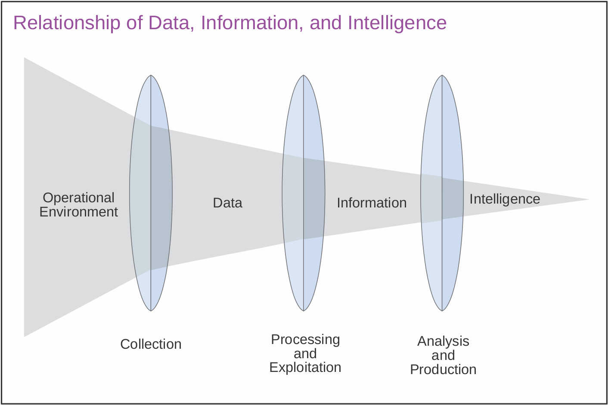

# Relationship of Data, Information, and Intelligence

Raw data has relatively limited utility and value. Its processing and
exploitation, however, transform data in information which can be used.
Coupling information with other information and past experience can
sometimes show this same information in a new light, which helps developing
new understanding of the information. At this point, it can be called
_intelligence_.

The analyse and comparison of information against other information and/or
databases helps use draw conclusions. Intelligence has two features that
distinguish it from information:

- Intelligence allows anticipation or prediction of future situations and
  circumstances
- Intelligence informs decisions by illuminating the differences in
  available courses of action

The revised edition of JP 2-0, _Joint Intelligence_ has a great figure to
illustrate the relationship of data, information and intelligence.

<figcaption class="">Figure I-1. Relationship of Data, Information, and Intelligence <small><a href="https://www.jcs.mil/Portals/36/Documents/Doctrine/pubs/jp2_0.pdf">Source</a></small></figcaption>
